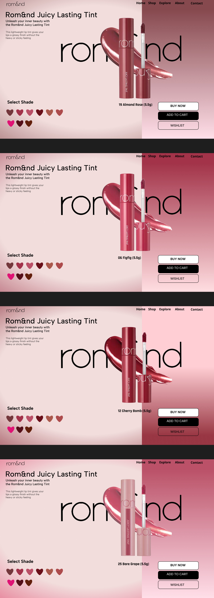

# romand-by-sania
A modern, visually engaging product page design for Rom&amp;nd Juicy Lasting Tint, created using Figma. Showcases shade variations, interactive UI elements, and elegant branding for a cosmetic e-commerce interface.

# Rom&nd Juicy Lasting Tint - UI Design

This repository contains a Figma-based mockup design for the **Rom&nd Juicy Lasting Tint** product page. The design highlights multiple shades of the product with a sleek, modern, and user-friendly layout.

## 🌸 Project Description

Unleash your inner beauty with the Rom&nd Juicy Lasting Tint.  
This lightweight lip tint gives your lips a glossy finish without the heavy or sticky feeling.  

Each section in the design displays:
- Product image with detailed tint packaging

- Interactive shade selector
- CTA buttons: Buy Now, Add to Cart, Wishlist

## ✨ Features

- Smooth shade-switching UI
- Aesthetic gradient background
- Consistent font and layout
- Figma prototype-based UI design (exported to image)

## 📷 Preview

## 🔧 Tools Used

- **Figma**: UI/UX Design
- **Canva** *(for preview text/typography)*
- **GitHub**: Version control and showcase

## 📁 Files Included

- `romand - by Sania Debbarma.jpeg`: The exported design mockup.
- `README.md`: Project overview and description.

## 🙋‍♀️ Designed By

**Sania Debbarma**  
Graphic Designer & UI/UX Enthusiast  

## 📝 License

This project is for personal portfolio and educational showcase purposes only. Product brand names and designs belong to their respective owners (Rom&nd).

---
